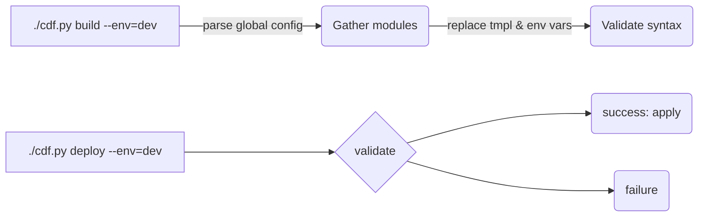

# Official Cognite Data Fusion project templates

This repository contains a set of Cognite Data Fusion (CDF) project templates used to
bootstrap CDF projects. The templates are modular and validated as official CDF project templates
geared towards use cases offered by Cognite and its partners.

In addition to supporting day 1 setup of a CDF project, the templates also support a workflow
with development, staging, and production projects where governed configurations are managed
and controlled through YAML-based configuration files. This is thus an alternative way to CLI tools
for CI/CD aka DevOps work flows for CDF projects.

## ALPHA NOTE

The templates and this repository is currently in ALPHA. The scope in alpha is on Asset
Performance Management focused on Infield (Digital Operator Rounds). The templates and tooling
will be continously improved throughout moving towards beta and general availability.

Below is an overview of the scope of what can be governed through using these templates:

## Quickstart

You can find an overview of the modules and packages in the [module and package documentation](./docs/overview.md).

The templates have been designed to be copied and checked into your own
Git repository, so you can manage changes and control how your CDF projects are configured
using YAML configuration files. The most important files are [local.yaml](./local.yaml) where you specify what
to load into a project, and the root [config.yaml](./config.yaml) file where you can set global
variables. You will find globally set configuration defaults in `default.config.yaml` files. These variables
can always be overridden by setting the same variable in a `config.yaml` file in the same directory.

### Identity Provider (Authentication and Authorization)

You can use any Identity Provider like Azure Entra (aka Active Directory), Auth0, or others suppored by CDF.
The tools here will load information about the project and the identity provider from environment variables.

The quickstart is that you should copy the .env.tmpl file to .env and set the environment variables for local use
of the scripts. See [Identity Provider documetation](./docs/idp.md) for more details on what the various
configurations are.

### Modules

The basic concepts are **modules** and **packages**. Modules live in the `modules/`, `local_modules`, `common/`, and `examples/`
directories. Each module is a self-contained set of configurations that configure some functionality
in a CDF project. The configurations are in YAML files that follow the
[CDF API specifications](https://api-docs.cognite.com). The yaml files are grouped in directories
inside the module's directory by CDF API type, see e.g. [examples/cdf_apm_simple](./examples/cdf_apm_simple).
In the root of the module directory, you will find a `default.config.yaml` file that defines the CDF project-specific
variables you can set for the module. Create your own `config.yaml` in the same directory overriding the default values.
Typically, there will also be a README.md in the module directory
that explains in more detail how the module has been built up and what you get when loading the module.

### Packages

Modules can depend on each other to form packages. For example, you may need to configure generic Asset Performance
Management (APM) functionality in your project before you install Infield or Maintain (APM
applications). A package is basically a list of modules
where the order is important. You can refer to packages and modules interchangeably in [local.yaml](./local.yaml).
All default packages are defined in the [default.packages.yaml](./default.packages.yaml) file. You can add your own
packages by editing packages.yaml in the root of your repository.

### Environments

The final concept is **environments**. An environment refers to a specific CDF project. Typically, you
will have a personal, local environment, a CDF project used for development, a staging CDF project
to validate configurations, and then finally a production CDF project. Different projects require different
modules to be loaded.  E.g. you may want to be able to
edit and change configurations in the development environment so you can quickly iterate, but in
production, you want to lock down configurations and only allow changes through the YAML configuration
files. You will find the definition of environments in the [local.yaml](./local.yaml) file.
As you can see from the example configuration, you can load different modules for groups and authentication
in the different environments. E.g. the package "demo_infield" loads groups for read/write access, as well
as sample data. In your production environment, you want to load the "infield" package.

### Practical steps

The basic flow is as follows: First you build the templates to substitute variables and gather
the modules that should be deployed. Then you deploy what was built to the CDF environment of choice:

So, with the above concepts in mind, these are the practical steps to go through to get started:

1. Create a new repository based on this template (delete/change the .github/ directory!).
2. Edit `local.yaml` to specify the modules you want to deploy for each environment you deploy to.
3. Edit `config.yaml` to override any global variables you want to change. If you want environment specific
   variables, you can prefix the variable name with the environment name, e.g. `prod.my_var: something`
4. (optional) For each `cdf_*` module, add/edit a `config.yaml` file in the module directory to override any
   variables you want to change from the `default.config.yaml` file.
5. (optional) Add any modules of your own that you may want to add in the `local_modules` folder (don't use `cdf_*` prefix).
6. Copy `.env.tmpl` to .env and edit the file to set the environment variables for your project.
7. Run `./cdf.py build --env=<demo|local|dev|staging|prod>` to create a build/ directory with the
   configurations.
8. Run `./cdf.py deploy --env=<demo|local|dev|staging|prod>` to deploy the configurations to your CDF project.

### Next steps

Once you have tried out the scripts and how to use the templates to deploy to your CDF project,
the next step is to set up a CI/CD pipeline where you can deploy to your staging and production
environments as part of your development workflow. The [advanced documentation](./docs/advanced.md)
explains in more detail how to build modules for your own projects.
