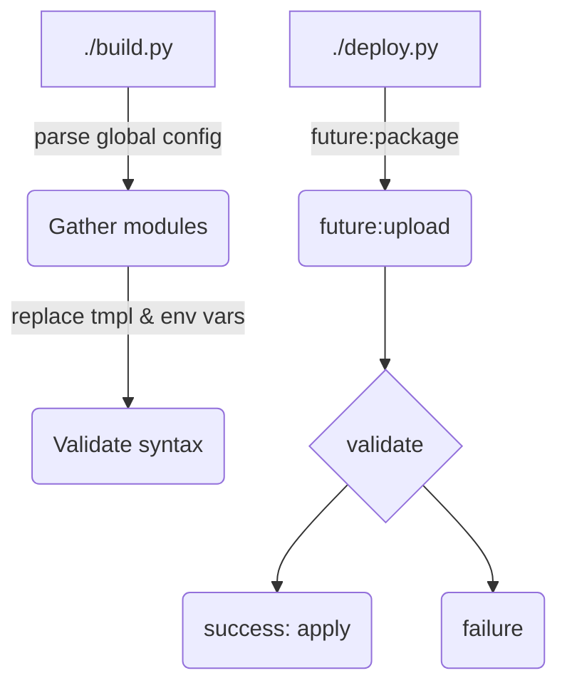
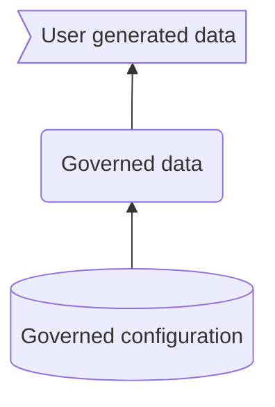

# Official Cognite Data Fusion project templates

>For Cogniters working on this repo, please refer to [INTERNAL](./INTERNAL.md) for more details.

This repository contains a set of Cognite Data Fusion (CDF) project templates that can be used to
bootstrap CDF projects. The templates are modular and validated as official CDF project templates
geared towards use cases offered by Cognite and its partners.


The above diagram shows the high-level scope of governed configurations that can be managed by
this repository. The templates are organized in modules that can be used individually or in
combination.

## Quick summary

These are the steps to get started with these templates:

1. Create a new repository based on this template.
2. Edit `local.yaml` to specify the modules you want to deploy.
3. Edit `config.yaml` to change any global variables you want to change.
4. (optional) For each `cdf_*` module, edit the `config.yaml` file to change any variables you want to change.
5. (optional) Add any modules of your own that you may want to add (don't use `cdf_*` prefix).
6. Run `./build.py` to create a build/ directory with the configurations.
7. Run `./deploy.py` to deploy the configurations to your CDF project.

## Target usage

Any user with admin control of a CDF project may use the templates. However, please be aware of the
following:

- The templates are designed to manage the lifecyle of a project, starting with a new project (day 0 and 1),
  i.e. either provisioned from Cognite or done as part of initial setup.
  If you have an existing project, you may use the templates,
  but if you have overlaps in external IDs for configuration entities like transformations, data models, etc,
  you will have to adjust the template before applying it to your project.
- Once a project is provisioned from these templates, you can continue to manage the governed parts of
  your projects using the templates. This repo is a Github template, so you can start a new repository
  based on this template and use it to manage your project. Your own modules should NOT have the `cdf_`
  prefix as it is reserved for official Cognite product modules.
- Currently, the utils/ directory contains Python code based on the Cognite Python SDK that is
  used to manage the project and the configurations are pushed to the various services in CDF as part
  of the deploy step. Over time, it is expected that this deployment of individual configurations will
  be replaced by CDF APIs that will allow lifecycle management of the configurations, as well as
  offer validation and integrity checks.

## Concepts

### CI/CD pipeline

The below shows the high-level process. The _build_ step is executed as part of the pipeline to
pick up the modules to be deployed, parse them, and replace with template variables from the local
configuration files, as well as any environment variables. The basic syntax is validated as part
of loading yaml and json files. The results are written to the build/ directory.

The _deploy_ step is then executed with the build/ directory as (default) parameter. A (future)
CDF configuration service will accept a zip file with the build/ directory as input and validate
the configurations, as well as reporting on changes that will be done. The validations will be
done initially as part of the utility scripts found in this repository, but will later be moved
to the CDF configuration service.

Once validations have passed, the configurations will be applied to the CDF project.



### Work process for governed configurations

Conceptually, data in a CDF project can be split into three different types as illustrated by the
diagram below.



The _governed configuration_ is the data that is managed by the templates in this repository. Once the
data pipelines and data products have been applied to the CDF project, the data ingestion will start.
This repository does _NOT_ manage the data that is ingested into the project, but it configures and enables
the ingestion to run and sets up the access control mechanisms.

The extractors that need to run outside CDF (i.e. inside the customer network to
get access to source systems) are not deployed directly from this repository, but you will find preconfigured
extractors with configuration that matches the CDF project pipeline configurations and data models. This
will allow you to boot up one of these templated extractors, connect it to the source system, and then
be live with ingestion into CDF.

The governed data will be governed by CDF data sets and data model spaces as configured in the
_Governed configuration_), and should not be
modified directly by users in CDF. As part of the governed configuration, certain data sets and spaces
will be open for writing to users in CDF. This is the 3rd level in the diagram, _User generated data_.
This data can be Charts, comments, annotations, and even transformations, functions, and data models.

In the governed data, you will also find the contextualizations that happen in CDF. Some of the
contextualizations may go through a process where initial contextualizations are done by the user
and live in the user generated data, but then are promoted to governed data.

User generated data like Cognite Functions, transformations, data models, and other data typically
start out as quick iterations and prototyping to solve a specific problem. Once the solution has
been approved for production use and/or you want to scale the solution to multiple assets, you
may want to move the solution to be governed. This is done by exporting the configurations for a solution
and then importing them into your governed configuration (the CDF project version of this template).

**NOTE!!** This work process is particularly suitable for a workflow with three CDF projects:
development, staging, and production. These three projects are then used to evolve the governed
configuration.

### Structure and setup

The templates are organized in modules that can be used individually or in combination. The modules
can be found in the ./modules directory, while common modules that other modules rely on can be found
in the ./common directory.

Modules are organized in a flat structure under ./common and ./modules. Each module has a structure
with directories for each type of configuration, e.g. ./modules/<moduleA>/transformations, ./modules/<moduleA>/data_models.

The recognized configuration types are:

```text
./modules|common/<moduleA>/
                              |- data_models/
                              |- data_sets/
                              |- auth/
                              |- functions/
                              |- transformations/
                              |- raw/
                              |- ext_pipelines/
                              |- extractors/

```

The `global.yaml` file is used as a configuration file to specify groups of modules. The `local.yaml`
file in root is used to specify the actual modules that should be deployed.

Normally, you should not touch `global.yaml` as this will evolve as new functionality is added to this
template. All your local changes on a per customer/project basis should go into the `local.yaml` file.

### Templating and configuration

Configuration variables should be defined in `config.yaml` files. The root `config.yaml` file has
scope for all modules, while each module can have its own `config.yaml` file that is only used for
that module.

Template variables in files in the common/ and modules/ directories should be in the form
`{{variable_name}}`.
If you want template variables to be replaced by environment variables, use the following format in the
.yaml file: `variable_name: ${ENV_VAR_NAME}`.

> You can also put `local.yaml` files in the
> `<modules>/<my_module>/`` directory. Any values here have only scope in that module.

The global.yaml and `local.yaml` files are then used by the _build_ step  to
process the configurations and create a `build/` directory where all the configurations are
merged into a single directory structure.

The `global.yaml` file has a simple structure. It currently only supports the global
configuration `packages` and only one. Each of the packages than can be loaded in local.yaml should
be defined as a list of modules. Packages that have been defined in global.yaml cannot
be used recursively in other packages, i.e. all modules have to be included in a package definition.

```yaml global.yaml

packages:
  <pkg_name1>: ["package1", "package2", ...]
  <pkg_name2>: ["package1", "package3", ...]

```

The `local.yaml` file is the actual configuration for a specific build and load operation.
Currently, it only supports `deploy` configurations. You can have multiple deploy configurations
in your file:

```yaml local.yaml

deploy: ["<a_base_module", "pkg_name2"]
deploy: ["<another_base_module", "pkg_name3"]

```

The order of configuration is important. In the above example, `a_base_module` will be loaded before
the modules in `pkg_name2`, which will be loaded before `another_base_module`. Finally, `pkg_name3`
modules will be loaded.