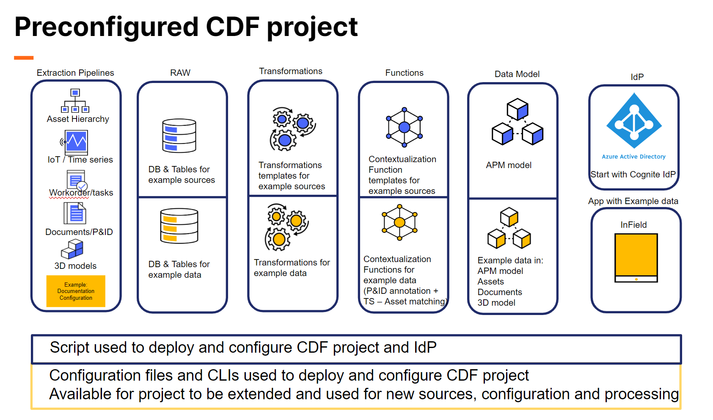

# Official Cognite Data Fusion project templates

The CDF Toolkit is a command-line interface (`cdf-tk`) used for configuring and administrating Cognite Data
Fusion (CDF) projects.
It supports three different modes of operation:

1. As an **interactive command-line tool** used alongside the Cognite Data Fusion web application to retrieve and
   push configuration of the different Cognite Data Fusion services like data sets, data models, transformations,
   and more. This mode also supports configuration of new Cognite Data Fusion projects to quickly get started.
2. As tool to support the **project life-cyle by scripting and automating** configuration and management of Cognite Data
   Fusion projects where CDF configurations are kept as yaml-files that can be checked into version
   control. This mode also supports DevOps workflows with development, staging, and production projects.
3. As a **tool to deploy official Cognite project templates** to your Cognite Data Fusion project. The tool comes
   bundled with templates useful for getting started with Cognite Data Fusion, as well as for specific use cases
   delivered by Cognite or its partners. You can also create your own templates and share them.

## ALPHA NOTE

The templates and the `cdf-tk` tool are currently in ALPHA. The scope in alpha is on Asset
Performance Management focused on Infield (Digital Operator Rounds). The templates and tooling
will be continously improved throughout moving towards beta and general availability.

Below is an overview of the scope of what can be governed through using these templates:



## Quickstart

To install the `cdf-tk` tool, you need a working Python installation >=3.9 (recommended 3.11).
Run: `pip install cognite-toolkit`

The `cdf-tk` tool is available as a command line tool. Run `cdf-tk --help` to see the available commands.

## Naming standards

A common structure on naming different CDF resource types and configuration are important from day one. Easy to use and understandable naming standard makes it easy to navigate and search on all components in a project as is grows in data sources, code, configuration, supported solutions and human resources working with and using the CDF solutions.

**Separation tokens**

* For external IDs the separation token is **’_’**  (underscore)  - this token works for all OS, when external ID matches usage of files
* For names the separation token is **’:’ or '_'**  (colon or underscore)  - these tokens matches usage in other CLI tools ang gives good readability

### Example usage of naming standard

In the example below we are setting up a project  based on the Open Industry Data (OID), that originates from the Valhall oil rig. Hence the example location below is *oid*

* the **location_name** = oid
* The different data sources are:
  * workmate (asset & workorder data)
  * fileshare (files and 3D)
  * PI (time series / data points)

```txt
CDF project
│
├── Data Sets:
│   ├── extId: ds_asset_oid ── name: asset:oid
│   │   ├── Extraction Pipelines:
│   │   │   └── extId: ep_src_asset_oid_workmate ── name: src:asset:oid:workmate
│   │   │
│   │   ├── RAW DB/tables:
│   │   │   └── DB: asset_oid_workmate ── table: assets
│   │   │
│   │   ├── Transformations:
│   │   │   └── extId: tr_asset_oid_workmate_asset_hierarchy ── name: asset:oid:workmate:asset_hierarchy
│   │   │
│   │   └── Autorisation groups:
│   │       ├── id: asset:oid:extractor
│   │       ├── id: asset:oid:prosessing
│   │       └── id: asset:oid:read
│   │ 
│   ├── extId: ds_files_oid ── name: files:oid
│   │   ├── Extraction Pipelines:
│   │   │   ├── extId: ep_src_files_oid_fileshare ── name: src:files:oid:fileshare
│   │   │   └── extId: ep_ctx_files_oid_fileshare:annotation ── name: ctx:files:oid:fileshare:annotation
│   │   │
│   │   ├── RAW DB/tables:
│   │   │   └── DB: files_oid_fileshare ── table: file_metadata
│   │   │
│   │   ├── Transformations:
│   │   │   └── extId: tr_file_oid_fileshare_file_metadata ── name: file:oid:metadata:fileshare:file_metadata
│   │   │
│   │   ├── Functions:
│   │   │   └── extId: fu_files_oid_fileshare_annotation ── name: files:oid:fileshare:annotation
│   │   │
│   │   └── Autorisation groups:
│   │       ├── id: files:oid:extractor
│   │       ├── id: files:oid:prosessing
│   │       └── id: files:oid:read
│   │ 
│   ├── extId: ds_workorder_oid ── name: workorder:oid
│   │   ├── ...
│   │   ...
│   │
│   ├── extId: ds_timeseries_oid ── name: timeseries:oid
│   │   ├── ...
│   │   ... 
│   │
│   ├── extId: ds_3d_oid ── name: 3d:oid
│   │   ├── ...
│   │   ... 
│ 
└── Spaces:
    └── extId: sp_apm_oid ── name: oid
```

### Naming elements

* **Data Type:**  asset, timeseries, workorder, files, 3d,... (use what is relevant for project)
* **Source:**  Source system where data originates from (ex, SAP, Workmate, Aveva, PI, Fileshare, SharePoint,..)
* **Location:** Location for Asset / System / Plant / installation
* **Pipeline Type:**  src = source data, ctx = contextualization, uc = use case, ...
* **Operation Type:** Type of operation/action/functionality in transformation or CDF function
* **Access Type:** Type of access used in authorization groups (ex: extractor, processing, read, ...)

**Data sets:**

```txt
External ID: ds_<data type>_<location>
Name: <data type>:<location>
Ex: ds_asset_oid / asset:oid 
```

**Extraction Pipelines:**

```txt
External ID: ep_<pipeline type>_<data type>_<location>_<source>
Name: <pipeline type>:<data type>:<location>:<source>:
Ex: ep_src_asset_oid_workmate / src:asset:oid:workmate 
```

**RAW DB/tables:**

```txt
DB: <data type>_<location>_<source>
Ex: asset_oid_workmate
Table: use name from source, or other describing name 
```

**Transformations:**

```txt
External ID: tr_<data type>_<location>_<source>_<operation type>
Name: <data type>:<location>:<source>:<operation type>
Ex: tr_asset_oid_workmate_asset_hierarchy / asset:oid:workmate:asset_hierarchy 
```

**Functions:**

```txt
External ID: fu_<data type>_<location>_<source>_<operation type>
Name: <data type>:<location>:<source>:<operation type>
Ex: fu_files_oid_fileshare_annotation / files:oid:fileshare:annotation
```

**Authorization groups:**

```txt
Name: <data type>:<source>:<access type>
Ex:  asset:valhall:extractor / asset:valhall:processing / asset:valhall:read  
```

**Data Model Spaces:**

```txt
External ID: dm_<data type>_<source>
Name: <data type>:<source>
Ex: dm_apm_oid / apm:oid 
```

## For more information

More details about the tool can be found at
[developer.cognite.com](http://developer.cognite.com/sdks/toolkit).

You can find an overview of the modules and packages in the
[module and package documentation](http://developer.cognite.com/sdks/toolkit/modules).

See [./CONTRIBUTING.md](./CONTRIBUTING.md) for information about how to contribute to the `cdf-tk` tool or
templates.
