# Build Command Flow Diagram

```mermaid
graph TD
    A["execute()"] -->|Load config & modules| B["build_config()"]
    
    B -->|Validate environment| C["validate_module_selection()"]
    C -->|Load variables| D["BuildVariables.load_raw()"]
    D -->|Initialize state| E["build_modules()"]
    
    E -->|For each module| F["For each module_variables"]
    F -->|Process resources| G["_build_module_resources()"]
    
    G -->|For each resource folder| H["Iterate resource_files"]
    H -->|Replace variables| I["_replace_variables()"]
    
    I -->|Check suffix| J{Is YAML file?}
    J -->|No| K["BuildSourceFile<br/>no loaded content"]
    J -->|Yes| L{Resource type?}
    
    L -->|data_models| M["Rename to<br/>data_modeling"]
    L -->|Other types| N["Check type"]
    M --> O["quote_int_value_by_key<br/>for version"]
    N --> P["Apply type-specific<br/>transformations"]
    O --> Q["read_yaml_content()"]
    P --> Q
    
    Q -->|Create BuildSourceFile| R["_get_builder()"]
    K --> R
    
    R -->|Create/Reuse Builder| S{Resource Type}
    S -->|data_modeling| T["DataModelBuilder"]
    S -->|transformations| U["TransformationBuilder"]
    S -->|functions| V["FunctionBuilder"]
    S -->|Other| W["GenericBuilder"]
    
    T -->|Process YAML| T1["Load data model defs"]
    T1 -->|Find GraphQL files| T2["_copy_graphql_to_build()"]
    T2 -->|Copy .graphql files| T3["BuildDestinationFile<br/>with extra_sources"]
    
    U --> U1["BuildDestinationFile"]
    V --> V1["BuildDestinationFile<br/>+ Validation metrics"]
    W --> W1["BuildDestinationFile"]
    
    T3 --> X["check_built_resource()"]
    U1 --> X
    V1 --> X
    W1 --> X
    
    X -->|Validate YAML| X1["validate_resource_yaml<br/>_pydantic()"]
    X1 -->|Extract identifier| X2["loader.get_id()"]
    X2 -->|Get dependencies| X3["loader.get_dependent<br/>_items()"]
    
    X3 -->|Check duplicates| X4{Already seen?}
    X4 -->|Yes| X5["DuplicatedItemWarning"]
    X4 -->|No| X6["Store in<br/>_ids_by_resource_type"]
    
    X5 --> Y["BuiltResource<br/>+ warnings"]
    X6 --> X7["Track in<br/>_dependencies_by_required"]
    X7 --> Y
    
    Y -->|Accumulate| Z["BuiltResourceList<br/>per folder"]
    Z -->|Validate directory| Z1["builder.validate_directory()"]
    Z1 -->|Return| AA["dict[str, BuiltResourceList]<br/>by resource name"]
    
    AA -->|Build all modules| AB["Check for duplicates<br/>across iterations"]
    AB -->|Create BuiltModule| AC["Append to BuiltModuleList"]
    
    AC -->|After all modules| AD["_check_missing_dependencies()"]
    AD -->|Get existing resources| AE["existing = <br/>_ids_by_resource_type"]
    AE -->|Find missing| AF["missing = <br/>_dependencies_by_required<br/> - existing"]
    
    AF -->|For each missing| AG{Is system resource?}
    AG -->|Yes cdf_*| AH["Skip check"]
    AG -->|No| AI{Exists in CDF?}
    
    AI -->|Check with client| AJ["_check_resource_exists<br/>_in_cdf()"]
    AJ -->|Not found| AK["MissingDependencyWarning"]
    AJ -->|Found| AL["Skip warning"]
    AI -->|No client| AK
    
    AH --> AM["build_environment<br/>.dump_to_file()"]
    AK --> AM
    AL --> AM
    
    AM -->|Return| AN["BuiltModuleList<br/>+ warnings"]
    
    style T fill:#4CAF50,color:#fff
    style AD fill:#2196F3,color:#fff
    style X fill:#FF9800,color:#fff
    style A fill:#9C27B0,color:#fff
    style AN fill:#9C27B0,color:#fff
```

## Key Stages:

### 1. **Configuration Loading** (execute → build_config)
- Loads CDF TOML and build config
- Validates environment settings
- Discovers modules and variables

### 2. **Variable Substitution** (_replace_variables)
- Reads source files
- Replaces template variables like `{{ var_name }}`
- Applies type-specific transformations (e.g., quote version for DataModels)

### 3. **Builder Pattern** (DataModelBuilder for data models)
- **DataModelBuilder** specifically:
  - Loads YAML data model definitions
  - Finds associated `.graphql` schema files
  - Copies GraphQL files to build directory
  - Links them via the `dml` field

### 4. **Resource Validation** (check_built_resource)
- Validates YAML against Pydantic schemas
- Extracts resource identifiers (`DataModelId` = space + external_id)
- Builds dependency graph via `get_dependent_items()`
- Detects duplicates and missing identifiers

### 5. **Dependency Tracking**
- Stores all resource IDs by type in `_ids_by_resource_type`
- Records dependencies in `_dependencies_by_required`
- Maps which resources depend on which

### 6. **Missing Dependency Validation** (_check_missing_dependencies)
- Compares required dependencies against built resources
- Skips system resources (CDF-owned: `cdf_*` space)
- Checks CDF for externally defined resources
- Issues warnings for unresolved dependencies

### 7. **Output Generation**
- Groups resources by folder (data_modeling, transformations, etc.)
- Creates `BuiltModule` objects with metadata
- Returns `BuiltModuleList` with build status
