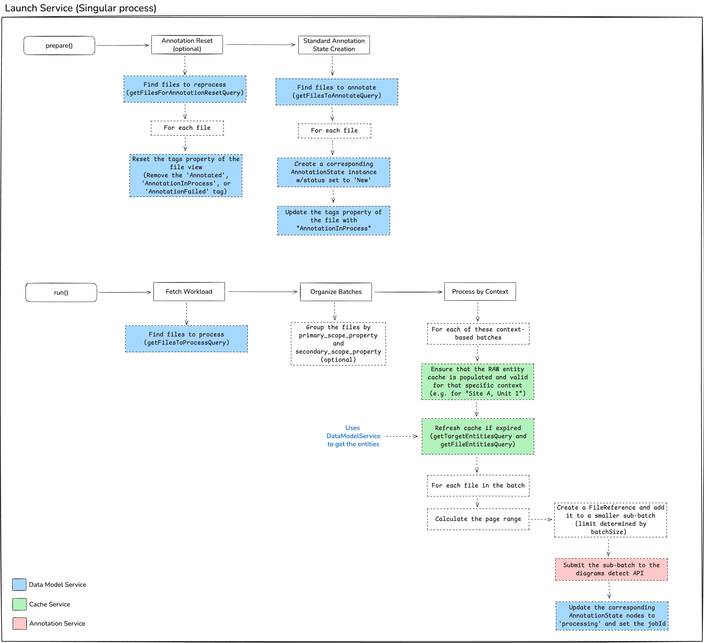
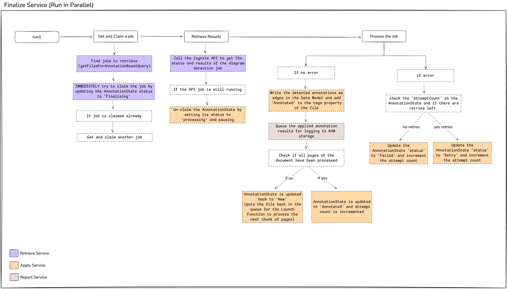

# Cognite Data Model-Based Annotation Function

## Overview

The Annotation template is a framework designed to automate the process of annotating files within Cognite Data Fusion (CDF). It uses a data model-centric approach to manage the annotation lifecycle, from selecting files to processing results and generating reports. This template is configurable, allowing it to adapt to various data models and annotation requirements.

## Key Features

- **Configuration-Driven Workflow:** The entire process is controlled by a single `config.yaml` file, allowing adaptation to different data models and operational parameters without code changes.
- **Large Document Support (\>50 Pages):** Automatically handles files with more than 50 pages by breaking them into manageable chunks, processing them iteratively, and tracking the overall progress.
- **Parallel Execution Ready:** Designed for concurrent execution with a robust optimistic locking mechanism to prevent race conditions when multiple finalize function instances run in parallel.
- **Detailed Reporting:** Local logs and processed annotation details stored in CDF RAW tables for auditing and analysis.
- **Local Running and Debugging:** Both the launch and finalize handler can be ran locally and have default setups in the 'Run & Debug' tab in vscode. Requires a .env file to be placed in the directory.

## Getting Started

Deploying this annotation module into a new Cognite Data Fusion (CDF) project is a streamlined process. Since all necessary resources (Data Sets, Extraction Pipelines, Functions, etc.) are bundled into a single module, you only need to configure one file to get started.

### Prerequisites

- Python 3.11+
- An active Cognite Data Fusion (CDF) project.
- The required Python packages are listed in the `modules/contextualization/cdf_file_annotation/functions/fn_dm_context_annotation_launch/requirements.txt` and `modules/contextualization/cdf_file_annotation/functions/fn_dm_context_annotation_finalize/requirements.txt` files.
- The necessary CDF data models (e.g., for files, assets, and annotation state) must be deployed in your CDF project.
- The necessary RAW tables for caching and reporting must be created.
- The file and target entity data models must include a property for entity matching, such as `aliases`. This property is used to match files to assets and should contain a list of alternative names or identifiers.

### Local Development and Debugging

This template is configured for easy local execution and debugging directly within Visual Studio Code.

1.  **Create Environment File**: Before running locally, you must create a `.env` file in the root directory. This file will hold the necessary credentials and configuration for connecting to your CDF project. Populate it with the required environment variables for `COGNITE_CLIENT_SECRET`, `COGNITE_CLIENT_ID`, `CDF_CLUSTER`, etc. In the `local_runs/` folder you'll find a .env template.

2.  **Use the VS Code Debugger**: The repository includes a pre-configured `local_runs/.vscode/launch.json` file. Please move the .vscode/ folder to the top level of your repo.

    - Navigate to the "Run and Debug" view in the VS Code sidebar.
    - You will see dropdown options for launching the different functions (e.g., `Launch Function`, `Finalize Function`).
    - Select the function you wish to run and click the green "Start Debugging" arrow. This will start the function on your local machine, with the debugger attached, allowing you to set breakpoints and inspect variables.
    - Feel free to change adjust the arguments passed into the function call to point to a test_extraction_pipeline and/or change the log level.

### Deployment Steps

1.  **Configure the Module**
    The core of the configuration is handled by the ` default.config.yaml` file located in `modules/contextualization/cdf_file_annotation/`. This file acts as a template for your project-specific settings. Before deploying, you need to replace the placeholder values (`<insert>`) with the actual values from your CDF project.

    Open `modules/contextualization/cdf_file_annotation/default.config.yaml` and update the following critical fields:

    - `fileExternalId`: The external ID of your file view.
    - `fileSchemaSpace`: The schema space for your file view.
    - `fileVersion`: The version of your file view.
    - `targetEntitySchemaSpace`: The schema space for your target entity view (e.g., assets).
    - `targetEntityExternalId`: The external ID of your target entity view.
    - `targetEntityVersion`: The version of your target entity view.

2.  **Deploy the Module**
    Once you have updated the `default.config.yaml` with your project-specific information, you can deploy the entire module using the Cognite Toolkit CLI. Navigate to the root of the `tk-annotation-function` directory and run the deployment command. The toolkit will handle the creation and deployment of all necessary resources, including the Launch and Finalize functions.

3.  **Run the Workflow**
    After deployment, the annotation process is managed by a workflow that orchestrates the `Launch` and `Finalize` functions. The workflow is automatically triggered based on the schedule defined in the configuration. You can monitor the progress and logs of the functions in the CDF UI.

## How It Works

The template operates in three main phases, orchestrated by CDF Workflows.

### Prepare Phase

- **Goal**: Identify files that need to be annotated or have their status reset.
- **Process**:
  1.  It queries for files that are marked for re-annotation and resets their status.
  2.  It then queries for new files tagged for annotation (e.g., with a "ToAnnotate" tag).
  3.  For each new file, it creates a corresponding `AnnotationState` instance in the data model, marking it with a "New" status.

### Launch Phase

- **Goal**: Launch the annotation jobs for files that are ready.
- **Process**:
  1.  It queries for `AnnotationState` instances with a "New" or "Retry" status.
  2.  It groups these files by a primary scope (e.g., `sysSite`) to provide context.
  3.  For each group, it fetches the relevant file and target entity information, using a cache to avoid redundant lookups.
  4.  It calls the Cognite Diagram Detect API to start the annotation job.
  5.  It updates the `AnnotationState` instance with the `diagramDetectJobId` and sets the status to "Processing".

### Finalize Phase

- **Goal**: Retrieve, process, and store the results of completed annotation jobs.
- **Process**:
  1.  It queries for `AnnotationState` instances with a "Processing" status.
  2.  It checks the status of the corresponding diagram detection job.
  3.  Once a job is complete, it retrieves the annotation results.
  4.  It applies the new annotations, optionally cleaning up old ones first.
  5.  It updates the `AnnotationState` status to "Annotated" or "Failed" and tags the file accordingly.
  6.  It writes a summary of the approved annotations to a CDF RAW table for reporting.

## Configuration

The templates behavior is entirely controlled by the `extraction_pipeline_config.yaml` file. This YAML file is parsed by Pydantic models in the code, ensuring a strongly typed and validated configuration.

Key configuration sections include:

- `dataModelViews`: Defines the data model views for files, annotation states, and target entities.
- `prepareFunction`: Configures the queries to find files to annotate.
- `launchFunction`: Sets parameters for the annotation job, such as batch size and entity matching properties.
- `finalizeFunction`: Defines how to process and apply the final annotations.

This file allows for deep customization. For example, you can use a list of query configurations to combine them with `OR` logic, or you can set `primaryScopeProperty` to `None` to process files that are not tied to a specific scope.

## Diving Deeper: Advanced Guides

This README provides a high-level overview of the template's purpose and architecture. To gain a deeper understanding of how to configure and extend the template, I highly recommend exploring the detailed guides located in the `modules/contextualization/cdf_file_annotation/detailed_guides/` directory:

- **`CONFIG.md`**: A comprehensive document outlining the `extraction_pipeline_config.yaml` file to control the behavior of the Annotation Function.
- **`CONFIG_PATTERNS.md`**: A practical guide with recipes for common operational tasks, such as processing specific subsets of data, reprocessing files for debugging, and tuning performance by adjusting the configuration.
- **`DEVELOPING.md`**: An essential guide for developers who wish to extend the template's functionality. It details the interface-based architecture and provides a step-by-step walkthrough on how to create and integrate your own custom service implementations for specialized logic.

## Design Philosophy

There were two principles I kept in mind when designing this template.

- **Evolving Needs:** Project requirements evolve. A simple, plug-and-play tool is great to start with, but it can hit limitations when faced with demands for scale, performance, or specialized logic—as was the case with previous annotation templates when applied to projects with tens of thousands of complex files. My belief is that a modern template must be built to be extended.

- **The Balance Between Configuration and Code:** This template is architected to provide two primary modes of adaptation, striking a crucial balance:

  1.  **Quick Start (via Configuration):** For the majority of use cases, a user should only need to edit the `config.yaml` file. By defining their data model views and tuning process parameters, they can get the template running quickly and effectively.
  2.  **Scaling (via Interfaces):** When a project demands unique optimizations—like a non-standard batching strategy or a complex query to fetch entities—the interface-based design provides the necessary "escape hatch." A developer can write a custom Python class to implement their specialized logic, ensuring the template can meet any future requirement.

## Architectural Highlights & Optimizations

This section explains some of the core design choices made to ensure the template is scalable, robust, and maintainable.

### Stateful Processing with Data Models

Instead of using a simpler store like a RAW table to track the status of each file, this module uses a dedicated `AnnotationState` Data Model. There is a 1-to-1 relationship between a file being annotated (e.g., `mpcFile`) and its corresponding `AnnotationState` instance. This architectural choice is deliberate and crucial for scalability and reliability:

- **Concurrency and Atomicity:** Data Model instances have built-in optimistic locking via the `existing_version` field. When multiple parallel functions attempt to "claim" a job, only the first one can succeed in updating the `AnnotationState` instance. All others will receive a version conflict error. This atomic, database-level locking is far more reliable and simpler to manage than building a custom locking mechanism on top of RAW.
- **Query Performance:** Finding all files that need processing (e.g., status is "New" or "Retry") is a fast, indexed query against the Data Model. Performing equivalent filtering on potentially millions of rows in a RAW table would be significantly slower and less efficient.
- **Schema Enforcement and Data Integrity:** The `AnnotationState` view enforces a strict schema for state information (`status`, `attemptCount`, `annotatedPageCount`, etc.), ensuring data consistency across the entire process. RAW tables offer no schema guarantees.
- **Discoverability and Governance:** The state of the annotation pipeline is exposed as a first-class entity in the CDF data catalog. This makes it easy to monitor progress, build dashboards, and govern the data lifecycle, which is much more difficult with state hidden away in RAW rows.

### Optimized Batch Processing & Caching

When processing tens of thousands of files, naively fetching context for each file is inefficient. This module implements a significant optimization based on experiences with large-scale projects.

- **Rationale:** For many projects, the entities relevant to a given file are often co-located within the same site or operational unit. By grouping files based on these properties before processing, we can create a highly effective cache.
- **Implementation:** The `launchFunction` configuration allows specifying a `primary_scope_property` (e.g., `sysSite`) and an optional `secondary_scope_property` (e.g., `sysUnit`). The `LaunchService` uses these properties to organize all files into ordered batches. The cache for entities is then loaded once for each context, drastically reducing the number of queries to CDF and improving overall throughput.

### Interface-Based Extensibility

The template is designed around a core set of abstract interfaces (e.g., `IDataModelService`, `ILaunchService`). This is a foundational architectural choice that enables scalability and long-term viability.

- **Contract vs. Implementation:** An interface defines a stable "contract" of _what_ a service should do. The provided `General...Service` classes offer a powerful default implementation that is driven by the configuration file.
- **Enabling Customization:** When a project's needs exceed the capabilities of the default implementation or configuration, developers can write their own concrete class that implements the interface with bespoke logic. This custom class can then be "plugged in" via the dependency injection system, without needing to modify the rest of the template's code.

## About Me

Hey everyone\! I'm Jack Zhao, the creator of this template. I want to give a huge shoutout to Thomas Molbach and Noah Karsky for providing invaluable input from a solution architect's point of view. I also want to thank Khaled Shaheen and Gayatri Babel for their help in building this.

This code is my attempt to create a standard template that 'breaks' the cycle where projects build simple tools, outgrow them, and are then forced to build a new, bespoke, and often hard-to-reuse solution. I genuinely believe it's impossible for a template to have long-term success if it's not built on the fundamental premise of being extended. Customer needs will evolve, and new product features will create new opportunities for optimization.
