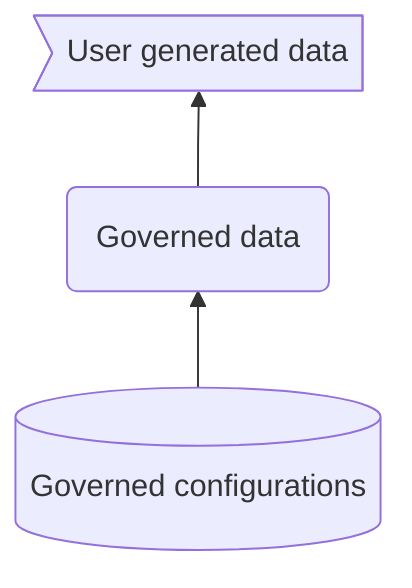

# Advanced usage of the CDF project templates

This section is for advanced users that want to understand the details of the templates and how
they are structured.

## Target usage

Any user with admin control of a CDF project may use the templates. However, please be aware of the
following:

- The templates are designed to manage the lifecyle of a project, starting with a new project (day 0 and 1),
  i.e. either provisioned from Cognite or done as part of initial setup.
  If you have an existing project, you may use the templates,
  but if you have overlaps in external IDs for configuration entities like transformations, data models, etc,
  you will have to adjust the template before applying it to your project.
- Once a project is provisioned from these templates, you can continue to manage the governed parts of
  your projects using the templates. This repo is a Github template, so you can start a new repository
  based on this template and use it to manage your project. Your own modules should NOT have the `cdf_`
  prefix as it is reserved for official Cognite product modules.
- Currently, the scripts/ directory contains Python code based on the Cognite Python SDK that is
  used to manage the project and the configurations are pushed to the various services in CDF as part
  of the deploy step.

## CI/CD pipeline

The below shows the high-level process. The _build_ step should be executed as part of your pipeline to
pick up the modules to be deployed, parse them, and replace with template variables from the local
configuration files, as well as any environment variables. The basic syntax is validated as part
of loading yaml files. The results are written to the build/ directory (unless you specify another target
directory).

The _deploy_ step is then executed with the build/ directory as (default) parameter. The validations will be
done initially as part of the scripts found in this repository, but will later be moved
to the CDF API.

Once validations have passed, the configurations will be pushed to the CDF project (using the Python SDK).

## Work process for governed configurations

Conceptually, data in a CDF project can be split into three different types as illustrated by the
diagram below.



The _governed configuration_ is the data that is managed by the templates in this repository. Once the
data pipelines and processing configurations have been applied to the CDF project, the data ingestion will start.
This repository does _NOT_ manage the data that is ingested into the project, but it configures and enables
the ingestion to run and sets up the access control mechanisms.

The extractors running outside CDF (i.e. inside the customer network to
get access to source systems) are not deployed directly from this repository, but you will find preconfigured
extractors with configuration that matches the CDF project pipeline configurations and data models. This
will allow you to boot up one of these templated extractors, connect it to the source system, and then
be live with ingestion into CDF.

The governed data will be governed by CDF data sets and data model spaces as configured in the
_Governed configuration_, and should not be
modified directly by users in CDF. As part of the governed configurations, certain data sets and spaces
will be created for writing for users in CDF. This is the 3rd level in the diagram, _User generated data_.
This data can be Charts, comments, annotations, and even transformations, functions, and data models.

In the governed data, you will also find the contextualizations that happen in CDF. Some of the
contextualizations may go through a process where initial contextualizations are done by the user
and live in the user generated data, but then are later promoted to governed data.

User generated data like Cognite Functions, transformations, data models, and other data typically
start out as quick iterations and prototyping to solve a specific problem. Once the solution has
been approved for production use and/or you want to scale the solution to multiple assets, you
may want to move the solution to be governed. This is done by exporting the configurations for a solution
and then importing them into your governed configuration (i.e. your version of this template).

**NOTE!!** This work process is particularly suitable for a workflow with three CDF projects:
development, staging, and production. These three projects are then used to evolve the governed
configuration.

## Structure and setup for modules

Modules are organized in a flat structure under ./common, ./modules, and ./examples. Each module has a structure
with directories for each type of configuration, e.g. ./modules/<moduleA>/transformations, ./modules/<moduleA>/data_models.

The recognized configuration types are:

```text
./modules|common/<moduleA>/
                              |- data_models/
                              |- data_sets/
                              |- auth/
                              |- functions/
                              |- transformations/
                              |- raw/
                              |- ext_pipelines/
                              |- extractors/

```

The `global.yaml` file is used as a configuration file to specify groups of modules. The `local.yaml`
file in root is used to specify the actual modules that should be deployed.

Normally, you should not touch `global.yaml` as this will evolve as new functionality is added to this
template. All your local changes on a per customer/project basis should go into the `local.yaml` file.

## Templating and configuration

In `local.yaml`, you specify details on the environments you want to deploy. The `build.py` script will
set CDF_ENVIRON and CDF_BUILD_TYPE = (dev, staging, prod) as environment variables.
These can be used in the `config.yaml` files.

Configuration variables used across your module configurations should be defined in `config.yaml` files.
The root `config.yaml` file has scope for all modules, while each module can have its own `config.yaml` 
file that is only used for that module.

Template variables in files in the common/ and modules/ directories should be in the form
`{{variable_name}}`.
If you want template variables to be replaced by environment variables, use the following format in the
config.yaml file: `variable_name: ${ENV_VAR_NAME}`.
If you want variables to be set dependent on the environment you deploy to (e.g. `build.py --env=prod`),
you can prefix the variable with environment name, e.g. use the following format in the config.yaml file:
 `prod.variable_name: something`.

> You can also put `config.yaml` files in the
> `<modules>/<my_module>/`` directory. Any values here have only scope in that module.

The global.yaml and `local.yaml` files are used by the _build_ step  to
process the configurations and create a `build/` directory where all the configurations are
merged into a single directory structure.

The `global.yaml` file has a simple structure. It currently only supports the global
configuration `packages` and only one. Each of the packages than can be loaded in local.yaml should
be defined as a list of modules. Packages that have been defined in global.yaml cannot
be used recursively in other packages, i.e. all modules have to be included in a package definition.

```yaml global.yaml

packages:
  <pkg_name1>: ["package1", "package2", ...]
  <pkg_name2>: ["package1", "package3", ...]

```

The `local.yaml` file is the actual configuration for a specific build and load operation.
Currently, it only supports `deploy` configurations. You can have multiple deploy configurations
in your file:

```yaml local.yaml

deploy: ["<a_base_module", "pkg_name2"]
deploy: ["<another_base_module", "pkg_name3"]

```

The order of configuration is important. In the above example, `a_base_module` will be loaded before
the modules in `pkg_name2`, which will be loaded before `another_base_module`. Finally, `pkg_name3`
modules will be loaded. If a module is loaded through more than one package, the first time it is loaded
will be the only time it is loaded.

## Module configuration files

In each module directory, each type needs a separate firectory, e.g. raw, transformations, etc. In each
directory, you can use prefixes of type 1.<filename.suffix>, 2.<filename2.suffix> to control the order of
deployment. If the configurations have a dependent file, e.g. for transformations where a transformation
can have a .sql file with the SQL code, the dependent file should have a filename of the external_id
of the entity it is associated with.

Example:
`2.tutorial-load-asset2children.yaml` defines the transformation with the external_id
`tutorial-load-asset2children`. The SQL code for the transformation should be in the file
`tutorial-load-asset2children.sql` (without the numeric prefix).

For RAW tables, you can only load table definitions for a single database in each module.
The database name should be configured in the module's `config.yaml` using the `raw_db` key.
It is possible to load example data in the table by having a file with multiple lines as
sample data.

### Spaces and instance deletion (data models)

Please note that `deploy.py` and `clean.py` will ONLY delete data in spaces that have been explicitly
defined by a `<space_name>.space.yaml` file in `data_models/` of the module. This is to avoid that
implicitly defined spaces referenced in the view and data model configurations are deleted. If you want
a space to be cleaned up, add an explicit space configuration file.

### Groups and group deletion

When deleting groups as part of `clean.py`, the script will only delete groups that the running
user/service principal is NOT a member of. This is to prevent that a cleaning operation removes
access rights from the running user. See the `clean.py` script for how you can force deletion
of any group.